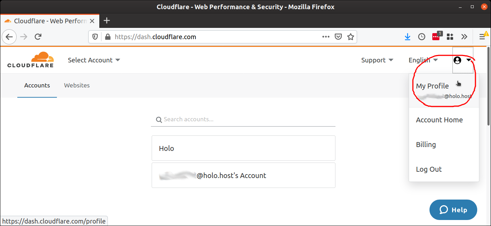
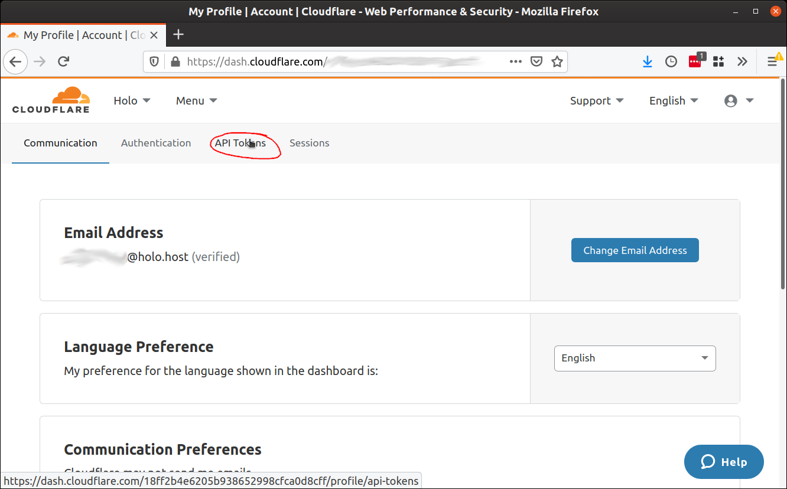
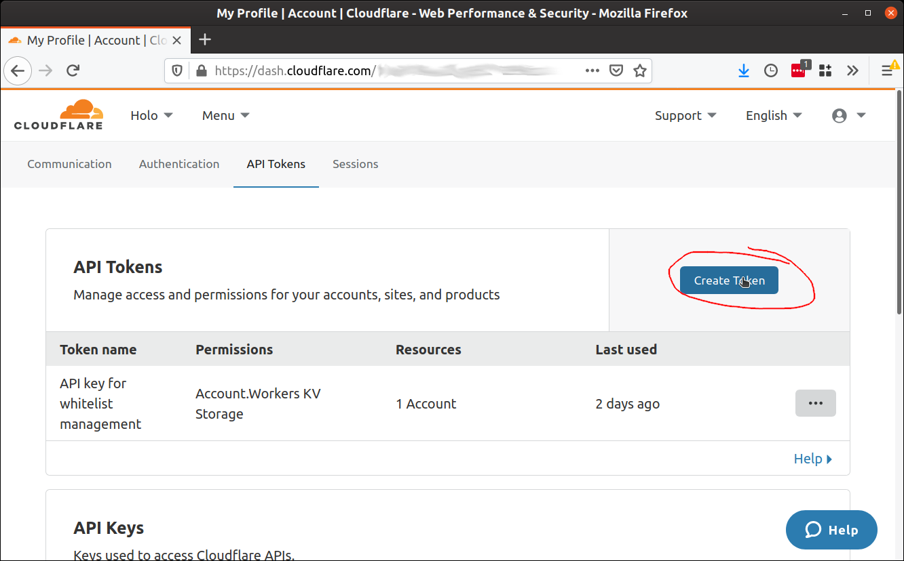
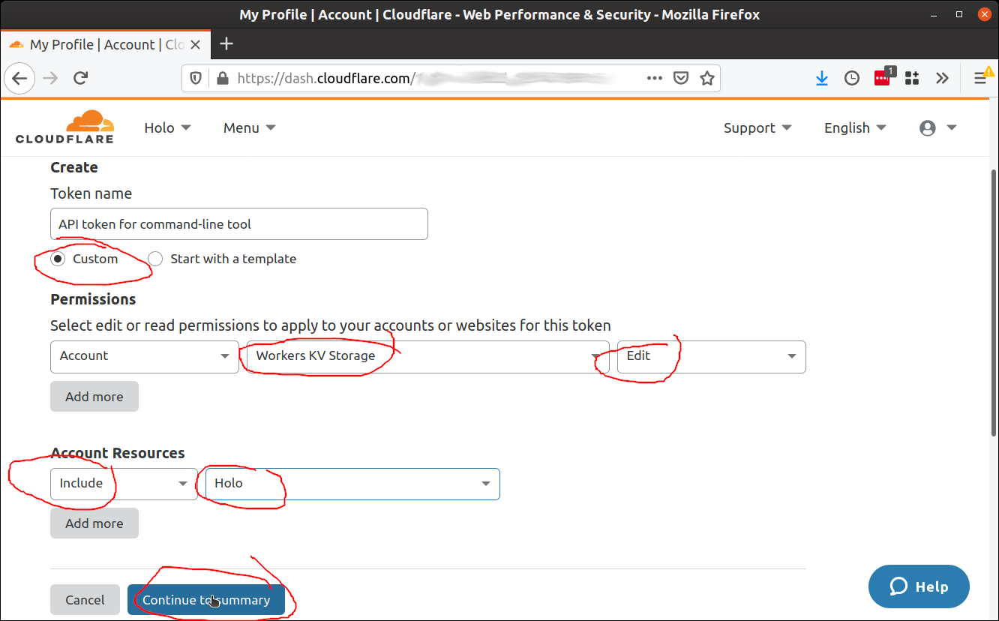
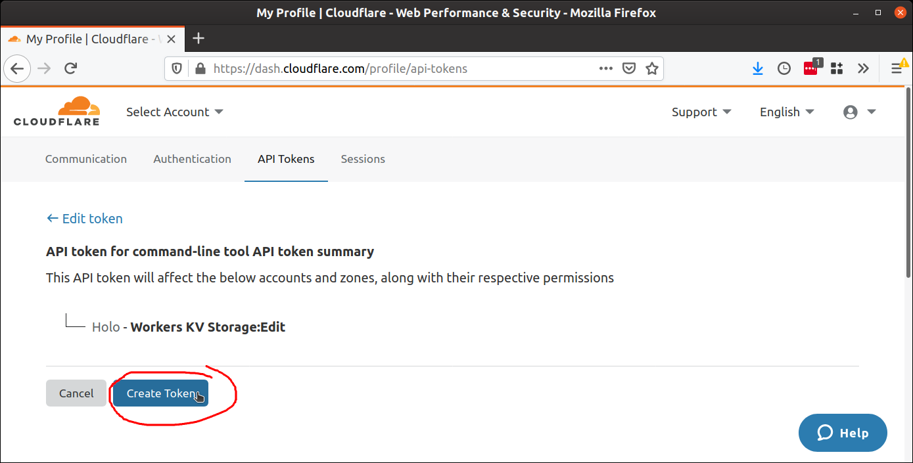
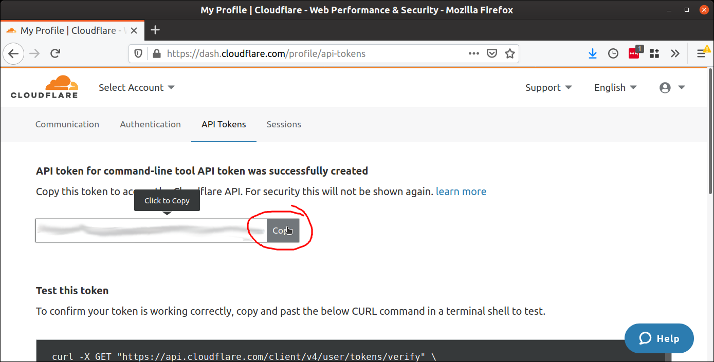
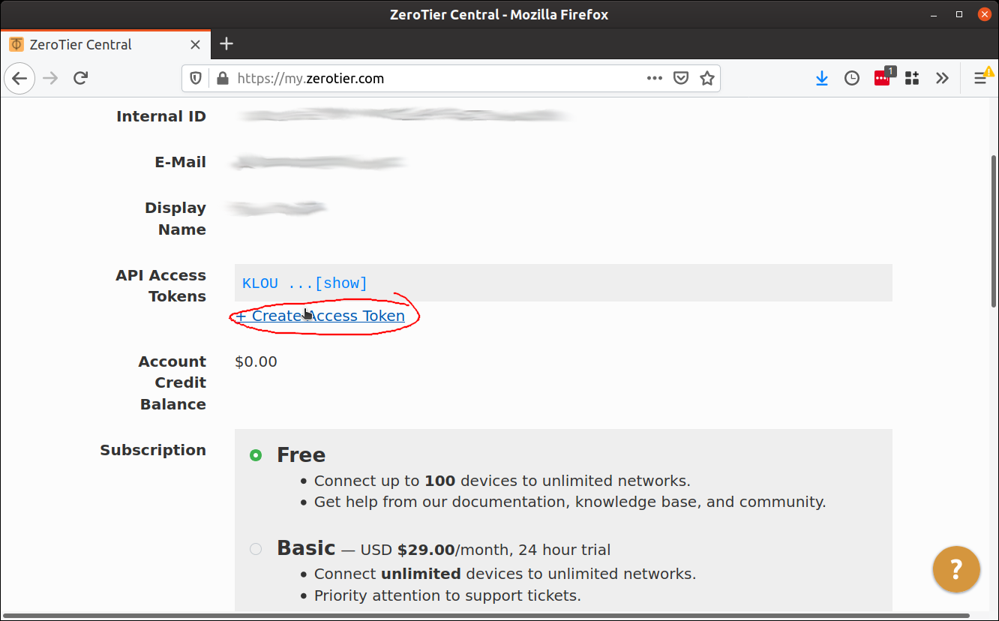
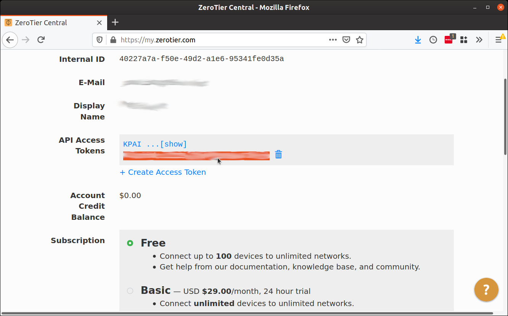

# holo-host-tools

A collection of little tools for making it easier to work with Holo Host.

## Installation

Scroll to the bottom of this page. There's a lot of stuff.

## `holoport-whitelist`

This tool lets you search and manipulate the whitelist from the CloudFlare K/V store. It’s much easier than paging through their horrible UI!

### Usage

* `holoport-whitelist`

    `holoport-whitelist list`

    Just show all the email addresses in the whitelist. The `list` parameter is optional, because this is the default action.

* `holoport-whitelist > whitelist.csv`

    Export the whitelist to a file.

* `holoport-whitelist --malformed-only`

    Only show malformed email addresses (upper-case or invalid characters).

* `holoport-whitelist search email1@example.com email2@example.com`

    `holoport-whitelist search < emails-to-search-for.txt`

    Quickly search the whitelist for one or more email addresses.

* `holoport-whitelist add email1@example.com email2@example.com`

    `holoport-whitelist add < emails-to-add.txt`

    Add one or more email addresses to the whitelist. Does all the cleanup for you, and throws an error for any emails it can’t clean up.

* `holoport-whitelist remove bad-email@example.com`

    Remove an email address (and all the malformed variants it can find) from the whitelist.

* `holoport-whitelist autofix`

    Looks for all malformed emails and tries to fix them. If an email is too malformed, it’ll skip it.

#### Parameters

* `--token <token>`

    `-t <token>`

    The CloudFlare authorization token to use for this call. Must have access to Holo's K/V store, and must have write access if adding, removing, or autofixing entries. If you don't have one, please talk to Holo TechOps.

* `--account <account_id>`

    `-a <account_id>`

    The ID of Holo's CloudFlare account that holds the whitelist. If you don't know it, please talk to Paul.

* `--namespace <namespace_id>`

    `-n <namespace_id>`

    The ID of the CloudFlare namespace that holds the whitelist. If you don't know it, please talk to Paul.

* `--malformed-only`

    `-m`

    Only operate on malformed emails in the whitelist. Valid for `list`, `search`, and `remove` actions.

* `--no-format`

    Most of the time malformed email addresses are highlighted to show their invalid characters and whether a properly formed variant exists in the whitelist. This turns that off. Valid for `list` (but only when `--malformed-only` is also specified), `search`, `remove`, and `autofix`.

* `--accept`

    `-y`

    Say yes to every change instead of prompting.

* `--dry-run`

    `-n`

    Say no to every change instead of prompting. Show what would be changed.

#### Environment variables

Put these variables into your `.profile` or `.bash_profile` file and you'll never have to specify them as flags.

* `HOLO_WHITELIST_CLOUDFLARE_TOKEN`

    Your CloudFlare API token. See the `--token` command-line flag for details.

* `HOLO_WHITELIST_CLOUDFLARE_ACCOUNT`

    The ID of Holo's CloudFlare account. See the `--account` comand-line parameter for more details.

* `HOLO_WHITELIST_CLOUDFLARE_NAMESPACE`

    The ID of the CloudFlare namespace that holds the namespace. See the `--namespace` command-line parameter for more details.

## `zerotier-members-list`

This tool lets you get the email addresses of all currently registered HoloPort owners. The ZeroTier UI is decent, but this is useful for exporting to a different service, like a mail campaign. Like `holoport-whitelist`, it outputs each email address on its own line.

### Usage

* `zerotier-members-list > registered-holoports.csv`

    Export the list to a file.

* `zerotier-members-list | grep -i email_address@example.com`

    Quickly search the members list for a single email address.

### Parameters

* `--token <token>`

    `-t <token>`

    The CloudFlare API token to use for this call. Must have access to Holo's K/V store, and must have write access if adding, removing, or autofixing entries. If you don't have one, please talk to Holo TechOps.

* `--network <network_id>`

    `-n <network_id>`

    The ID of the ZeroTier network that contains the HoloPorts. If you don't know it, you can get it from Paul.

### Environment variables

* `HOLO_ZEROTIER_TOKEN`

    The ZeroTier authorization token. See the `--token` command-line parameter for more details.

* `HOLO_ZEROTIER_NETWORK`

    The ID of the HoloPort ZeroTier network. See the `--network` command-line parameter for more details.

## Prerequisites

* A computer with macOS, Linux, or [WSL (Windows Subsystem for Linux)](https://docs.microsoft.com/en-us/windows/wsl/install-win10) with a popular Linux distribution installed.
* Ruby
    * macOS: it should already be installed
    * Ubuntu Linux or WSL with Ubuntu: open the terminal and type `sudo apt install ruby`
* Access to Holo's accounts on CloudFlare and ZeroTier (create a personal account for both, then talk to Mamading in TechOps, `@mamading` on Mattermost to get access)
* Two API tokens, once you've gotten access to Holo's CloudFlare and ZeroTier accounts:
    * A token that lets you access Holo's Worker K/V stores on Cloudflare. If you're going to be making modifications to the whitelist, make sure it has both read and write access. Remember the token; you'll use it below where you see `<your_cloudflare_api_token>`.
        1. After logging into your CloudFlare account, hover over your avatar in the upper-right corner, then click on 'My Profile.'
            
        2. Click on 'API Tokens' in the top toolbar.
            
        3. Click on the 'Create Token' button.
            
        4. Give your token a name that reminds you that it's for the command-line tool, fill out as follows, then click 'Continue to summary'.
            
        5. You'll be shown a summary of the token you're about to create. Click 'Create Token'.
            
        6. You'll be shown your new token. Copy it into a safe place that nobody else can access.
            
    * A token that lets you access the Holo Host ZeroTier network. You'll use it below where you see `<your_zerotier_api_token>`.
        1. After logging into your ZeroTier account, you'll see your profile. Click the 'Create Access Token' link.
            
        2. Your token will be created. Click '[show]' to see and copy it.
            
5. Three pieces of information from Paul (`@pauldaoust` on Mattermost):
    * Holo's CloudFlare account ID. You'll use it below where you see `<holos_cloudflare_account_id>`.
    * The CloudFlare Worker K/V namespace ID for the Holo Host whitelist. You'll use it below where you see `<holo_host_whitelist_namespace_id>`.
    * The ZeroTier network ID for the Holo Host network. You'll use it below where you see `<holo_host_zerotier_network_id>`.

## Installation (for both commands)

1. Download the script (look in the `src` folder of this repository).
2. Make it executable (you can do this in the terminal by typing `chmod +x <name_of_script>`).
3. Put it in a place where your computer can easily find it.
    * macOS: `/usr/local/bin` (requires admin privileges)
    * Linux: `~/.local/bin`
4. Open up your system's terminal profile file in a text editor (replacing `<user>` with your actual username):
    * Linux: `/home/<user>/.bash_profile`
    * macOS (pre-Catalina): `/Users/<user>/.bash_profile`
    * macOS (Catalina and later): `/Users/<user>/.zprofile`
5. Add these five lines to the end of the terminal profile file (replacing the placeholders with the appropriate values):
    ```
    HOLO_WHITELIST_CLOUDFLARE_TOKEN=<your_cloudflare_api_token>
    HOLO_WHITELIST_CLOUDFLARE_ACCOUNT=<holos_cloudflare_account_id>
    HOLO_WHITELIST_CLOUDFLARE_NAMESPACE=<holo_host_whitelist_namespace_id>
    HOLO_ZEROTIER_TOKEN=<your_zerotier_api_token>
    HOLO_ZEROTIER_NETWORK=<holo_host_zerotier_network_id>
    ```
6. Run this command to make the above configuration active:
    * Linux and macOS (pre-Catalina): `source ~/.bash_profile`
    * macOS (Catalina and later): `source ~/.zshrc`
